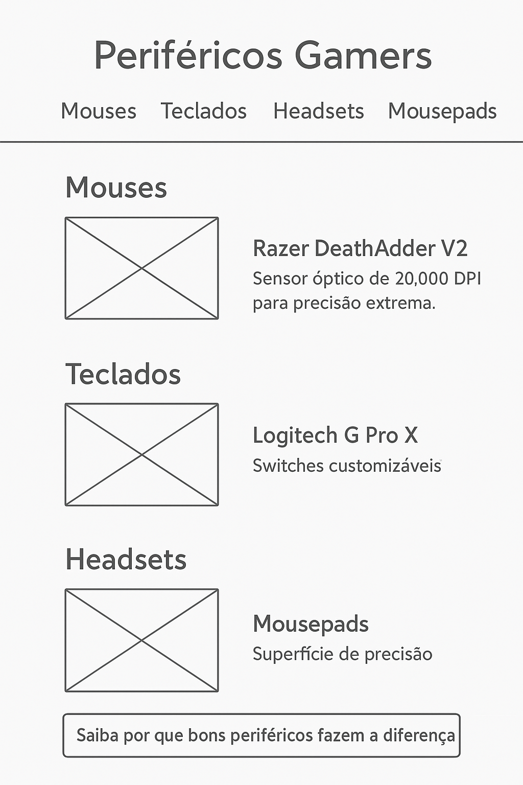
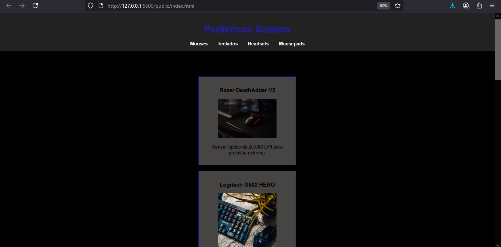

# Trabalho Prático - Semana 03

Dessa vez, vamos escolher uma proposta de projeto para trabalhar.

Nessa atividade, você deverá montar a página inicial do projeto escolhido, a organização do HTML aplicando semântica correta e uso aprimorado do CSS. Leia o enunciado completo no Canvas para mais detalhes.

**IMPORTANTE:** Você deve trabalhar e alterar apenas arquivos dentro da pasta **`public`**. Deixe todos os demais arquivos e pastas desse repositório inalterados. **PRESTE MUITA ATENÇÃO NISSO.**

## Informações Gerais

- Nome: Gabriel Eduardo de Oliveira
- Matricula: 2520753
- Proposta de projeto escolhida: Home Page sobre perifericos gamers.
- Breve descrição sobre seu projeto: Esta é uma Home Page que fala sobre perifericos gamers em um geral, mostrando abas em que cada produto se insere, contendo imagens e descricao de tal. Logo ao fim da pagina temos um link de um blog contando um pouco mais sobre a importancia de se ter bons equipamentos.

## Print do(s) wireframe(s) criado

## Print da home-page criada

